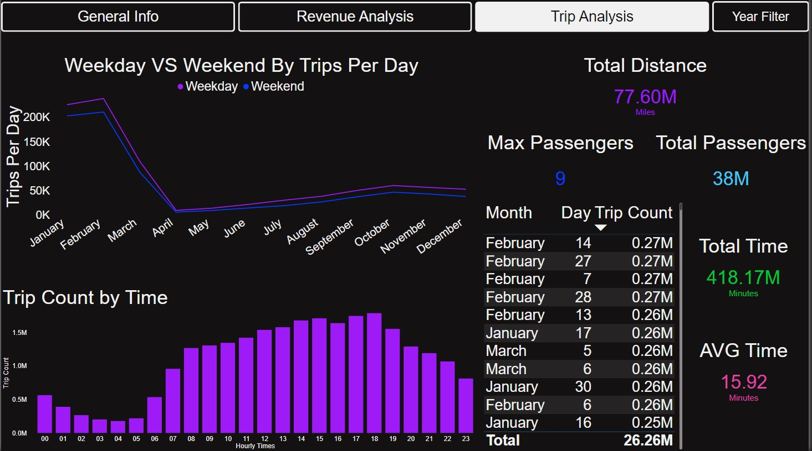

# Program Name: **_`Covid 19 Taxi Data Analysis`_ Using `Power-BI and Python`**

## Description

This project aims to explore the yellow and green taxi data before, during, and after the COVID-19 pandemic in New York City. The analysis includes data from 2018 to 2022 obtained from the official website of the New York City Taxi and Limousine Commission.

## Data Collection

To collect the data, the following steps were followed:

1. Download the data from the New York City Taxi and Limousine Commission website: [https://www.nyc.gov/site/tlc/about/tlc-trip-record-data.page](https://www.nyc.gov/site/tlc/about/tlc-trip-record-data.page).
2. The data was provided in separate Parquet files for each month and year per yellow and green taxi types. Only data from 2018 to 2022 was selected for analysis.

## Data Processing

The data processing pipeline consists of several steps:

1. **Folder Creation** (`folder_creation.py`): This script creates a folder structure to organize the taxi data. It creates a base folder and nested subfolders using the `os.mkdir` function.
2. **Parquet to CSV Conversion** (`parquet_to_csv.py`): This script converts the Parquet files to CSV format using the pandas library and pyarrow.parquet. It lists the Parquet files in an input folder, reads them, and writes CSV files in an output folder. This process is performed separately for the "Green Taxi" and "Yellow Taxi" data.
3. **Combining CSV Files** (`combine_csv_files.py`): This script combines individual CSV files into a single output file for each taxi type. It iterates through the CSV files, adds a "taxi_type" column, and appends the data to the output file. This step ensures that the data from different months and years is consolidated into a single file for further processing.
4. **Data Cleaning** (`data_cleaning.py`): This script cleans and combines the "Yellow Taxi" and "Green Taxi" data from separate CSV files into a single output file. The following steps are performed for each taxi type:
   * Removal of specific columns and renaming of certain columns according to predefined changes.
   * Filtering rows based on the desired years.
   * Calculation of the time difference in minutes between pickup and drop-off times.
   * Extraction of the pickup time and date from the pickup datetime.
   * Modification of certain columns by removing parentheses and adding new columns.
   * Replacement of missing values in the passenger_count and payment_type columns.
   * Application of additional filtering conditions on various columns.
   * Conversion of payment_type codes to their respective values.
   * Creation of additional columns such as hourly_times, grouped_total_times, and day_type.
   * Reordering of the columns based on the new header.
   * Appending the cleaned data to the target file.

## Data Analysis and Reporting

Once the data is cleaned and combined, it is ready for analysis using Power BI. The following files are included for analysis and reporting:

* **Covid Taxi Report.pbix** : This PBIX file contains a comprehensive analysis of the yellow and green taxi data. It comprises three pages:
  * General Information and Visualizations: Provides an overview of trip details, including trip count, duration, distance, payment types, and popular trip months.
  * Revenue Analysis: Focuses on revenue trends, including revenue distribution, tip versus distance, and average tip percentage of fare.
  * Comprehensive Taxi Trips Analysis: Offers a detailed analysis of taxi trips, including trip volume, duration, passenger count, popular hours, trip distances, and weekday versus weekend trips.

To access the Power BI report, download the [Covid Taxi Report.pbix](https://1drv.ms/u/s!AtmtmqmbhFZ2gcwacdN28RLGraaEXg?e=ZVKfKa) file from the provided OneDrive link, file is 1.8 GB FYI.

* **All PDF Files** : These files are captures of the PBIX document at different points in time. Each PDF represents a specific set of filtered years for the data analysis and is named accordingly.

## Visual Analysis: 2020 Trip Analysis

Here is a visual representation of the trip analysis specific to the year 2020.

## How to Run the Project

To run the project, follow these steps:

1. Download the data from the [New York City Taxi and Limousine Commission website](https://www.nyc.gov/site/tlc/about/tlc-trip-record-data.page) for the desired years (2018-2022).
2. Ensure that the required dependencies, such as pandas and pyarrow, are installed.
3. Before running any scripts, make sure to edit the `config.py` file according to your needs. Adjust any necessary configurations, such as file paths or other variables, based on your system setup.
4. Run the following scripts in the given order:

   * `folder_creation.py`: This script creates the necessary folder structure for organizing the taxi data. Place all the downloaded Parquet files for yellow and green taxis into their respective folders created by `folder_creation.py`.
   * `parquet_to_csv.py`: This script converts the Parquet files to CSV format.
   * `combine_csv_files.py`: This script combines individual CSV files into a single output file for each taxi type.
   * `data_cleaning.py`: This script cleans and combines the "Yellow Taxi" and "Green Taxi" data into a single output file.
5. Import the cleaned and combined data into Power BI.
6. Open the [Covid Taxi Report.pbix](https://1drv.ms/u/s!AtmtmqmbhFZ2gcwacdN28RLGraaEXg?e=ZVKfKa) file in Power BI to explore the visualizations and analysis.
7. Refer to the generated PDF files for previous versions of the report at different points in time.

Note: Make sure to adjust any file paths or configurations in the `config.py` file and other scripts as needed to match your system setup and file locations.

## Additional Resources

* `config.py`: Contains global variables used in various files. Edit this file to configure the project according to your system setup.
* `Data Dictionary.xlsx`: Provides column names and descriptions for the original columns of the Green Taxi, Yellow Taxi, and combined data files.
